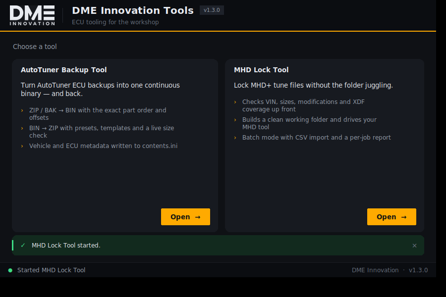
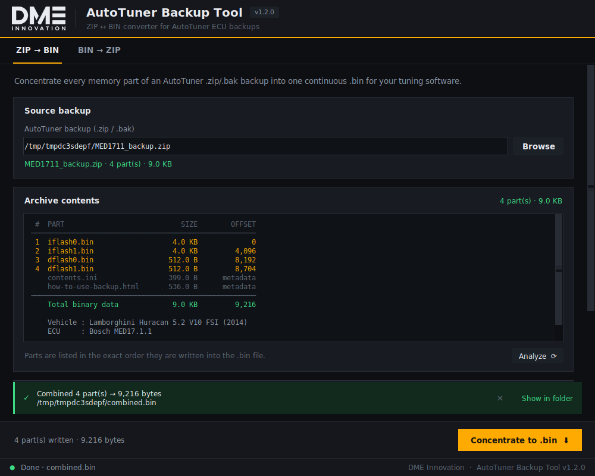
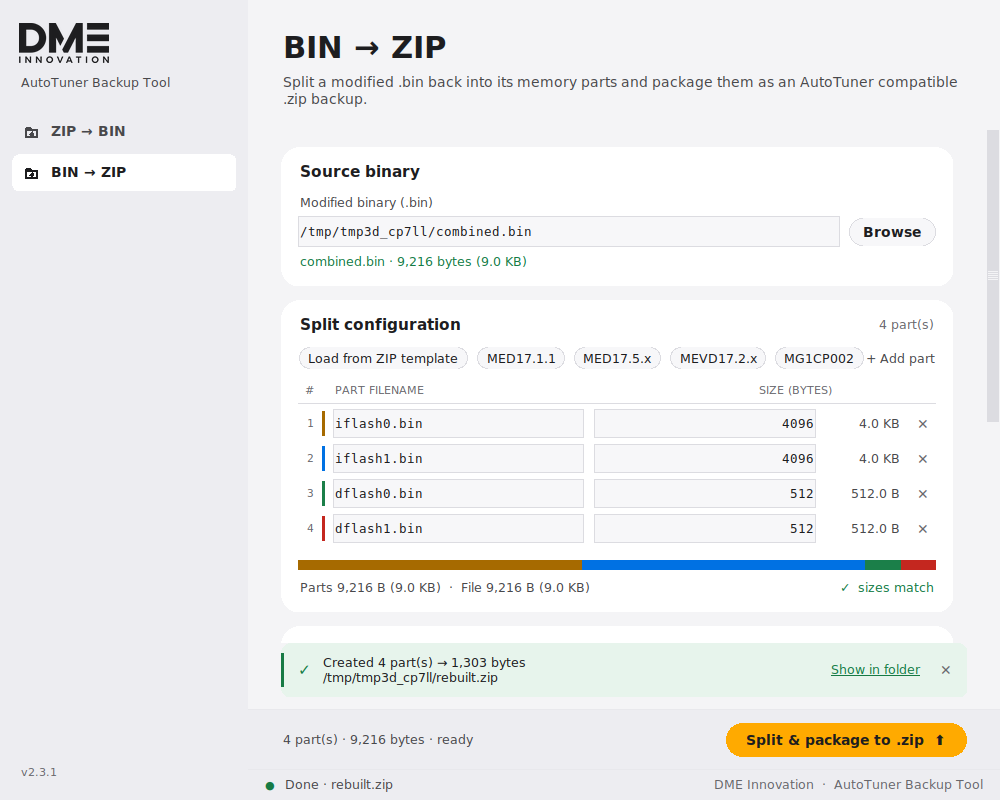
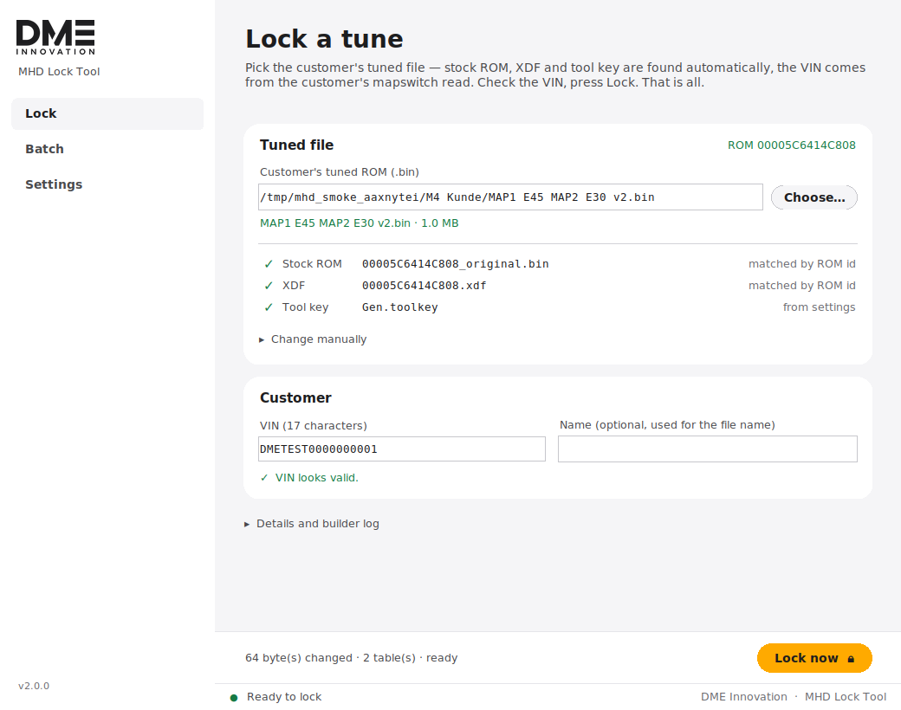
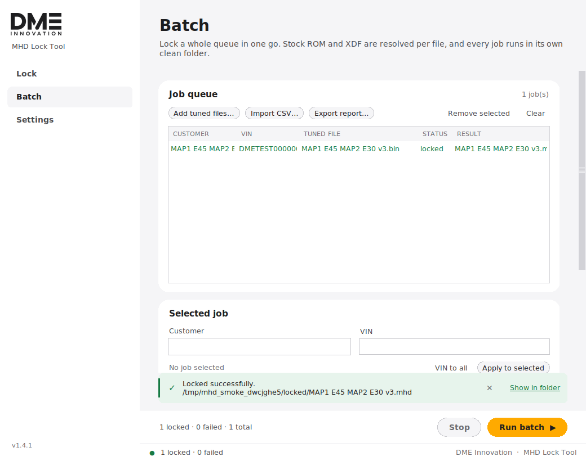
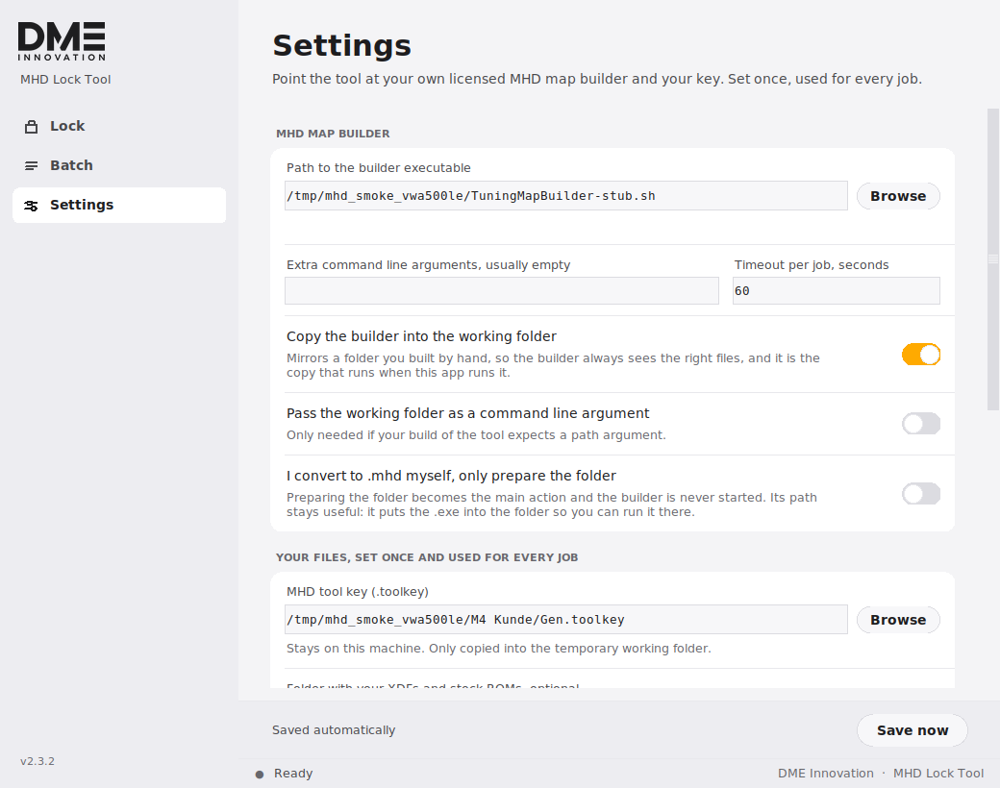

<p align="center">
  
  
</p>

<h1 align="center">DME Innovation Tools</h1>

<p align="center">Zwei Windows-Werkzeuge für die Arbeit am Steuergerät — in einer Installation.</p>

<p align="center">
  <a href="https://github.com/dmeinnovation777-droid/Tools/releases/latest"><b>⬇ Setup herunterladen</b></a>
</p>



| Tool | Zweck |
| --- | --- |
| **AutoTuner Backup Tool** | AutoTuner-Backups (`.zip`/`.bak`) zu einer durchgehenden `.bin` zusammenführen und wieder zurück verpacken |
| **MHD Lock Tool** | Locken von MHD+ Tune-Files: getunte Datei wählen, fertig — Stock-ROM, XDF, Tool-Key und VIN findet die App selbst |

Beide laufen mit der Python-Standardbibliothek (nur `tkinter` für die
Oberfläche) — keine Fremdpakete zur Laufzeit. Die Darstellung ist
DPI-bewusst: auf Bildschirmen mit 125 %, 150 % oder 200 % Skalierung wird
scharf gezeichnet statt hochgerechnet, und das Logo liegt in den passenden
Größen bereit.

---

## Inhalt

- [Installation](#installation)
- [AutoTuner Backup Tool](#autotuner-backup-tool)
- [MHD Lock Tool](#mhd-lock-tool)
- [Selbst bauen](#selbst-bauen)
- [Projektstruktur](#projektstruktur)
- [Branding anpassen](#branding-anpassen)
- [Tests](#tests)
- [Wichtige Hinweise](#wichtige-hinweise)

---

## Installation

**Eine Datei, ein Doppelklick.** Das Setup liegt unter
[Releases](https://github.com/dmeinnovation777-droid/Tools/releases/latest)
unter *Assets*:

```
DME-Innovation-Tools-Setup-1.4.0.exe
```

Windows zeigt bei unsignierten Setups „Der Computer wurde durch Windows
geschützt" — über **Weitere Informationen → Trotzdem ausführen** fortfahren.

Das Setup installiert beide Werkzeuge samt Starter, legt Startmenü- und
(optional) Desktop-Verknüpfungen an und bringt einen Uninstaller mit.
Standardmäßig wird nur für den aktuellen Benutzer installiert — dann fragt
Windows nicht nach Administratorrechten; im Assistenten lässt sich auch „für
alle Benutzer" wählen. Deutsch und Englisch stehen zur Auswahl.

Installiert werden:

```
DME Innovation Tools.exe      Starter — zeigt beide Werkzeuge zur Auswahl
AutoTuner Backup Tool.exe
MHD Lock Tool.exe
```

Jeder Git-Tag `v*` baut das Setup automatisch und veröffentlicht es als Release.
Ohne Tag hängt der Actions-Lauf es als Artefakt an. Lokal geht es mit
`build_installer.bat` (siehe [Selbst bauen](#selbst-bauen)).

**Ohne Installation, direkt aus den Quellen:**

```bat
:: Python 3.10 oder neuer, bei der Installation "tcl/tk and IDLE" anhaken
python dme_suite.py          :: Starter
python autotuner_tool.py     :: oder direkt ein Werkzeug
python mhd_lock_tool.py
```

Auf Linux zusätzlich `sudo apt install python3-tk`.

---

## AutoTuner Backup Tool



### ZIP → BIN

1. AutoTuner-Backup (`.zip` oder `.bak`) auswählen — der Inhalt wird sofort
   analysiert.
2. Die Vorschau zeigt jeden Speicherbereich mit Größe und **Offset in exakt der
   Reihenfolge, in der er in die `.bin` geschrieben wird**, dazu Fahrzeug- und
   Steuergerätedaten aus der `contents.ini`.
3. Zielpfad wählen und **Concentrate to .bin** — alle Teile werden
   aneinandergehängt.

### BIN → ZIP



1. Geänderte `.bin` auswählen. Passt die Dateigröße zu einem bekannten Layout,
   wird das Preset automatisch gesetzt.
2. Aufteilung festlegen — meistens von allein:
   * **Gemerkte Aufteilung.** Jedes Archiv, das das Tool öffnet oder
     zusammenführt, hinterlegt seine Aufteilung unter der Gesamtgröße. Eine
     `.bin`, die dieses Tool erzeugt hat, lässt sich dadurch immer wieder
     aufteilen — auch bei einem Steuergerät, für das es kein Preset gibt.
   * **Preset**, wenn die Dateigröße zu MED17.1.1, MED17.5.x, MEVD17.2.x oder
     MG1CP002 passt.
   * **Load from ZIP template** aus einem Original-Backup, oder von Hand.

   Der Balken zeigt die Aufteilung, die Anzeige daneben meldet sofort Überhang
   oder fehlende Bytes.
3. Optional Fahrzeug-/ECU-Daten eintragen (landen in der `contents.ini`).
4. **Split & package to .zip** — erzeugt ein AutoTuner-kompatibles Archiv:

```
iflash0.bin           internes Flash, Bank 0
iflash1.bin           internes Flash, Bank 1
dflash0.bin           Daten-Flash, Bank 0
dflash1.bin           Daten-Flash, Bank 1
contents.ini          Fahrzeug-/ECU-Metadaten
how-to-use-backup.html
```

Die Teile liegen direkt im Archivwurzelverzeichnis (nicht in einem Unterordner) —
`contents.ini` und `how-to-use-backup.html` sind byteweise im Originalformat.

### Tastenkürzel

| Taste | Funktion |
| --- | --- |
| `Ctrl` + `O` | Datei auswählen |
| `F5` | Archiv neu analysieren |
| `Ctrl` + `Enter` | Aktion des aktiven Tabs ausführen |

---

## MHD Lock Tool



### Was es macht — und was nicht

Das Tool **automatisiert den Ablauf rund um das offizielle MHD Map Encryption
Tool** (TuningMapBuilder / XDF_Tools), so wie ihn der MHD+ Tuning Guide
beschreibt. Es verschlüsselt nichts selbst, ersetzt nichts und umgeht nichts —
das Locken erledigt weiterhin deine eigene lizenzierte MHD-Exe, die du unter
**Settings** einträgst. Die Exe ist absichtlich nicht Teil dieses Projekts.

Der Handbetrieb scheitert fast immer an denselben Kleinigkeiten: zwei XDFs im
Ordner, eine vergessene `_vin.txt`, eine falsch benannte Stock-Datei, eine
zweite `.toolkey`, eine Datei ohne Änderungen. Genau das fängt dieses Tool ab.

### Ablauf

**Einmal einrichten** (Tab *Settings*): Pfad zur eigenen MHD-Exe und zur
`.toolkey`. Optional ein Ordner mit XDFs und Stock-ROMs, falls die nicht neben
den Kundendateien liegen.

**Danach pro Auftrag:**

1. **Getunte Datei wählen.** Stock-ROM, XDF, Tool-Key und VIN findet die App
   selbst — siehe unten.
2. **VIN prüfen.** Liegt die Kundendatei (`…_mapswitch.bin`) im Ordner, ist die
   VIN schon eingetragen; sonst eintippen. Wird live geprüft (17 Zeichen, ohne
   I/O/Q) und automatisch in Großbuchstaben normiert.
3. **Lock now.**

### Die Datei vom Kunden

Kunden schicken ihren Backup-Read so, wie die MHD-App ihn speichert:

```
WBS42AY040FR10018_00005C64148205_mapswitch.bin
└── VIN ─────────┘ └─ Programm-ID ┘
```

Diese Datei muss **nicht umbenannt werden** — einfach zusammen mit der getunten
Datei in den Auftragsordner legen. Die App erkennt sie als Original (die
Programm-ID aus dem Namen wird gegen das getunte Image geprüft), übernimmt die
VIN aus dem Namen und legt sie im Arbeitsverzeichnis automatisch als
`00005C64148205_original.bin` ab — exakt die Umbenennung, die man sonst von
Hand macht. Download-Kopien (`… (1).bin`, `… - Kopie.bin`) werden genauso
erkannt.

Die VIN wird dabei **nur aus einem Read übernommen, der zu diesem Auftrag
gehört**: er muss neben der getunten Datei liegen und die Programm-ID dieses
ROMs tragen. Grund: eine Programm-ID benennt einen Softwarestand, kein Auto —
zwei Kunden auf demselben Stand teilen sie sich. Ein archivierter Read aus dem
Bibliotheksordner dient deshalb weiter als Original, liefert aber nie die VIN.
Liegen zwei Reads mit verschiedenen VINs im Ordner, bleibt das Feld leer statt
zu raten. Weicht eine eingetippte VIN vom Kundendateinamen ab, warnt die
Vorprüfung.

### Wie die App die restlichen Dateien findet

Die BMW-Programmnummer steht als sieben gepackte Bytes im ROM
(`00005C6414C808` → `00 00 5C 64 14 C8 08`). Die App liest sie nicht heraus,
sondern **prüft umgekehrt**: für jede Kandidatendatei im Ordner wird die
Nummer aus dem Dateinamen genommen und geschaut, ob sie wirklich im getunten
Image steht. Nur dann gilt die Datei als passend — eine XDF vom Nachbarauto
wird so nie versehentlich genommen.

Gesucht wird zuerst im Ordner der getunten Datei, danach im optionalen
Bibliotheksordner samt Unterordnern. Ohne Nummer im Namen greift die
Rückfallregel „die einzige eindeutige Datei im selben Ordner".

**Die ganze MHD-XDF-Sammlung als Bibliothek.** Unter *Settings* trägst du den
kompletten XDF-Ordner ein — Plattform, DME, Softwarestände, Unterordner bis
sechs Ebenen tief. Sobald die ROM-Nummer aus der Kundendatei feststeht, wird
die passende XDF allein über den Dateinamen gefunden; auch bei mehreren tausend
XDFs bleibt das im Hundertstelsekunden-Bereich. Liegen mehrere XDFs zur selben
ROM-Nummer vor (verschiedene Revisionen), nimmt die App die neueste und sagt es
im Log.

Ein typischer Kundenordner braucht also gar keine Einrichtung:

```
WBS…_00005C6414C808_mapswitch.bin  ← Kundendatei, unverändert: Original + VIN
00005C6414C808.xdf                 ← per ROM-Nummer erkannt
Gen.toolkey                        ← daneben gefunden
MAP1 E45 MAP2 E30 v4.bin           ← die eine Datei, die du auswählst
```

Als Original gehen genauso `*_original.bin`, `*_orig.bin`, `*_stock.bin` und
`*.org`; eine `<VIN>_vin.txt` aus einem früheren Lauf liefert die VIN, falls
keine Kundendatei da ist.

Was die App ermittelt hat, steht mit Häkchen und Quelle direkt unter der
Dateiauswahl. Stimmt etwas nicht, klappt **Change manually** die drei Felder auf.

### Prüfungen

Die **Vorprüfung** läuft automatisch bei jeder Änderung und meldet:
   - fehlende oder doppelte Eingaben, falsche VIN, nicht vorhandener Ausgabeordner
   - unterschiedliche Dateigrößen von Stock und Tune
   - identische Dateien (der Builder würde `NO modifications found` melden)
   - **alle geänderten Regionen** mit Offset, Länge und den betroffenen
     XDF-Tabellen
   - Änderungen, die diese XDF nicht beschreibt (rein informativ — der Builder
     bringt eigene Tabellendefinitionen mit)
   - abweichende Software-IDs zwischen Stock und Tune
Beim Locken legt das Tool ein sauberes Arbeitsverzeichnis an, startet den
Builder darin, zeigt dessen Ausgabe live und farbig, holt die erzeugte `.mhd`
ab, benennt sie nach Vorlage und legt ein `.log` mit Prüfergebnis und
Builder-Ausgabe daneben.

Unter **Details and builder log** liegen das vollständige Protokoll und
**Prepare folder only** — das baut nur das Arbeitsverzeichnis, falls du den
Builder lieber selbst startest.

### Arbeitsverzeichnis

Für jeden Job wird ein eigener, temporärer Ordner gebaut, der exakt einem
handgebauten entspricht:

```
00005C6414C808.xdf                  die XDF (genau eine)
00005C6414C808_original.bin         Stock-ROM, immer auf _original.bin normiert
                                    (auch aus <VIN>_<ID>_mapswitch.bin)
MAP1 E45 MAP2 E30 v4.bin            die getunte Datei (Originalname bleibt)
DMETEST0000000001_vin.txt           leer — die VIN steckt im Dateinamen
Gen.toolkey                         dein MHD-Schlüssel
TuningMapBuilder-v6.exe             Kopie des Builders, wird dort ausgeführt
```

Danach wird der Ordner wieder entfernt (abschaltbar unter **Advanced**).

### Batch



Mehrere Kunden in einem Durchgang. Jeder Job bekommt sein eigenes
Arbeitsverzeichnis — eine kaputte Datei kann keinen anderen Kunden beeinflussen.

- **Add tuned files…** löst Stock-ROM, XDF und Tool-Key für **jede Datei
  einzeln** auf — Tunes verschiedener Autos dürfen in derselben Warteschlange
  stehen. Fehlt eine VIN, sagt das Log welche Zeilen betroffen sind.
- **Import CSV…** liest eine Liste:

  ```csv
  customer,vin,tuned_bin,stock_bin,xdf
  Kunde A,DMETEST0000000001,tunes/kunde_a_v2.bin,,
  Kunde B,DMETEST0000000002,tunes/kunde_b.bin,,
  ```

  `stock_bin` und `xdf` sind optional; leer bedeutet „aus dem Lock-Tab".
  Relative Pfade beziehen sich auf den Ort der CSV. Semikolon und Tabulator
  werden ebenfalls erkannt, die Kopfzeile darf fehlen.
- **Export report…** schreibt Status und Ergebnisdatei pro Job als CSV.

### Einstellungen



| Einstellung | Bedeutung |
| --- | --- |
| Pfad zum Builder | deine `TuningMapBuilder-*.exe` bzw. MHD Map Encryption |
| MHD tool key | deine `.toolkey` — einmal setzen, gilt für jeden Auftrag |
| Ordner mit XDFs und Stock-ROMs | optional; nur nötig, wenn diese nicht neben der getunten Datei liegen |
| Extra-Argumente | normalerweise leer |
| Timeout pro Job | Abbruch, falls der Builder hängt |
| Builder ins Arbeitsverzeichnis kopieren | entspricht dem Handbetrieb (empfohlen) |
| Arbeitsverzeichnis als Argument | nur falls deine Version einen Pfad erwartet |
| Ausgabeordner | Standardablage der `.mhd` |
| Namensvorlage | `{customer} {vin} {date} {time} {datetime} {tuned} {stock} {source} {n}` — `{source}` behält den Namen, den der Builder vergeben hat |
| Ordner nach Erfolg öffnen | Explorer springt zur fertigen Datei |
| Arbeitsverzeichnis behalten | zum Nachsehen, was der Builder gesehen hat |

Gespeichert wird automatisch nach
`%APPDATA%\DME Innovation\mhd_lock_tool.json`
(macOS `~/Library/Application Support/…`, Linux `~/.config/…`).
Eine Deinstallation lässt diese Datei stehen, damit eine Neuinstallation den
Builder-Pfad wiederfindet.

### Erfolg und Fehler

Der Builder endet mit `Press a key…` und liefert deshalb keinen verlässlichen
Exit-Code. Ausgewertet wird stattdessen seine Konsolenausgabe: als Erfolg gilt
`Map correctly written` **und** eine tatsächlich erzeugte `.mhd`. Meldungen wie
`Error - one and only one xdf …`, `Missing your .toolkey file`,
`Invalid key`, `******** CRC error` oder `Modification not in xdf` werden
erkannt, rot hervorgehoben und in den Job-Report übernommen.

---

## Selbst bauen

Auf einem Windows-Rechner mit Python:

```bat
build_installer.bat     :: baut die drei .exe und daraus das Setup
build_exe.bat           :: nur die drei .exe, ohne Setup
```

`build_installer.bat` benötigt zusätzlich [Inno Setup 6](https://jrsoftware.org/isdl.php)
(`winget install JRSoftware.InnoSetup`). Ergebnis:

```
dist\DME-Innovation-Tools-Setup-1.4.0.exe
dist\DME Innovation Tools.exe
dist\AutoTuner Backup Tool.exe
dist\MHD Lock Tool.exe
```

Ohne Windows-Rechner: der Workflow `.github/workflows/build.yml` baut auf einem
Windows-Runner beide Programme und das Setup und hängt alles als Artefakt an den
Lauf. Die Versionsnummer kommt aus `dme_brand.VERSION` — dort ändern, und
Programme, Setup und Dateiname ziehen mit.

---

## Projektstruktur

```
dme_suite.py             Starter — listet die Werkzeuge und startet sie
autotuner_tool.py        AutoTuner Backup Tool (Logik + GUI)
mhd_lock_tool.py         MHD Lock Tool (Logik + GUI)
dme_ui.py                gemeinsames Design-System (Cards, Tabs, Banner, Tabellen …)
dme_brand.py             Produktname, Version, eingebettetes DME-Logo, Fenster-Icon
installer/               Inno-Setup-Skript für das Windows-Setup
build_exe.bat            PyInstaller-Build der drei Programme
build_installer.bat      Build inklusive Setup-Datei
tools/generate_assets.py erzeugt alle Logo-Assets aus dem Vektor-Master
tools/xwd2png.py         Screenshot-Helfer für die headless GUI-Tests
assets/                  Icon, Wortmarken, Logo-Quelle (.ai)
tests/                   Unit-Tests und GUI-Smoke-Tests
docs/                    Screenshots
```

---

## Branding anpassen

Alle Bildmarken entstehen aus einer einzigen Quelle:
`assets/logo-source/DME-Innovation.ai`.

```bash
pip install pymupdf pillow
python tools/generate_assets.py          # Assets neu rendern + dme_brand.py aktualisieren
python tools/generate_assets.py --check  # nur prüfen, ob alles aktuell ist
```

Erzeugt werden Icon (16–256 px als `.ico`), Wortmarke in Schwarz und Weiß sowie
die base64-Blobs, die direkt in `dme_brand.py` liegen — die Programme brauchen
zur Laufzeit also keine Bilddateien.

Produktname und Version stehen oben in `dme_brand.py`, die Akzentfarbe und die
komplette Palette oben in `dme_ui.py`.

---

## Bedienphilosophie

Die Programme tragen links eine feste Navigation, darüber den Namen der
aktuellen Ansicht mit einer Zeile Erklärung, unten eine Statusleiste und über
ihr die Aktion, die auf dieser Seite ansteht. Flächen heben sich durch
Helligkeit voneinander ab statt durch Rahmen, Karten und Knöpfe haben runde
Ecken.

Dazu zwei Regeln, an die sich beide Programme halten:

- **Keine Fenster ohne Anlass.** Keine Tooltips, die beim Überfahren aufspringen,
  keine Bestätigungsdialoge für Routine, keine Bereiche, die sich von selbst
  aufklappen. Rückmeldung erscheint dort, wo gearbeitet wird — in der Zeile über
  dem Knopf und im farbigen Streifen darüber.
- **Nur fragen, was die App nicht selbst weiß.** Alles, was aus einer Datei
  hervorgeht, wird abgeleitet und mit Häkchen und Quelle angezeigt.

## Tests

```bash
python -m unittest discover -s tests -v        # 112 Tests, keine Anzeige nötig

# GUI-Tests (brauchen tkinter und eine Anzeige)
xvfb-run -a -s "-screen 0  880x560x24" python tests/smoke_gui_suite.py
xvfb-run -a -s "-screen 0 1000x800x24" python tests/smoke_gui_autotuner.py
xvfb-run -a -s "-screen 0 1040x820x24" python tests/smoke_gui_mhd_lock.py
```

Der GUI-Test des Lock Tools ersetzt den lizenzierten Builder durch ein Stub-
Skript, das dieselben Konsolenmeldungen ausgibt — damit läuft die komplette
Kette (Prüfung → Staging → Lauf → Ablage) auch ohne MHD-Software durch.
Weitere Tests halten Starter, Build-Skript und Installer synchron: ein
umbenanntes Werkzeug fällt sofort auf, statt erst im Setup.

---

## Wichtige Hinweise

- **Keine Fremdsoftware im Projekt.** Weder das MHD Map Encryption Tool noch der
  MHD+ Tuning Guide liegen hier — beides gehört MHD Tuning und bleibt bei dir.
- **Keine Kundendaten committen.** `.toolkey`, `*_vin.txt`, `*.mhd` und
  `TuningMapBuilder*.exe` stehen in der `.gitignore`. Die VIN in den Screenshots
  und Tests (`DMETEST…`) ist frei erfunden.
- Vor jedem Flash gilt weiterhin: eigenes, geprüftes Backup des Steuergeräts.

<sub>© DME Innovation</sub>
